# 🏦 Lending Club Loan Default Prediction

A comprehensive machine learning project to predict loan defaults using the Lending Club dataset and optimized threshold based on target Bad-rate(10%), with end-to-end model development, explainability, and interactive dashboard deployment.

**Bad rate**: The proportion of loans that have become defaulted, indicating the percentage of loans that are unlikely to be fully repaid.

## 📖 Project Overview

This project tackles the challenge of predicting loan defaults in peer-to-peer lending. Rather than just building a model, I focused on creating a complete, production-ready system that includes:

- **Thorough Exploratory Data Analysis** to understand lending patterns
- **Advanced Feature Engineering** with interaction terms and domain knowledge
- **Model Optimization** using Optuna for hyperparameter tuning  
- **Business-Aligned Thresholding** based on bad rate control (not just accuracy)
- **Model Explainability** with SHAP for transparent decisions
- **Interactive Dashboard** for real-time loan assessment

## 🎯 Key Results

- **ROC AUC**: 0.74+ (competitive performance for credit risk)
- **Recall**: 76% (successfully identifies 3 out of 4 defaults)
- **Business Threshold**: Optimized for 10% bad rate with 49% approval rate
- **Explainable**: Every prediction comes with clear reasoning

## 📊 Dataset

Using the **Lending Club Dataset** (2007-2018), publicly available and widely used for credit risk modeling:
- 2.2M+ loan records with 150+ features
- Comprehensive borrower information, credit history, and loan terms
- Focus on completed loans only (Fully Paid vs Charged Off/Default)

## 🔍 Key Visualizations & Insights

Here are some key findings from the analysis:

### Income Verification Paradox
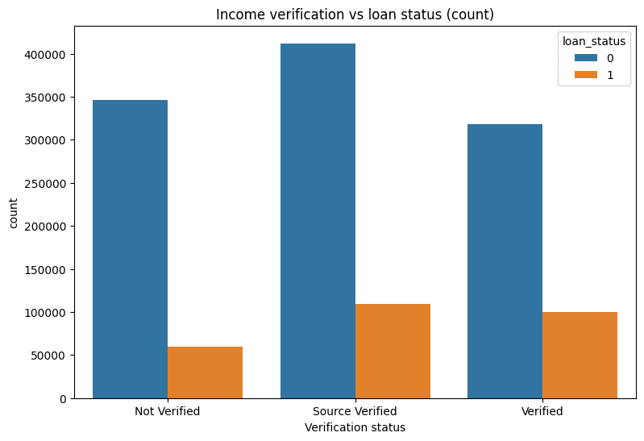

Surprisingly, borrowers with verified income default more often - this reveals that verification is targeted toward riskier applicants, not random.

### Geographic Risk Patterns  
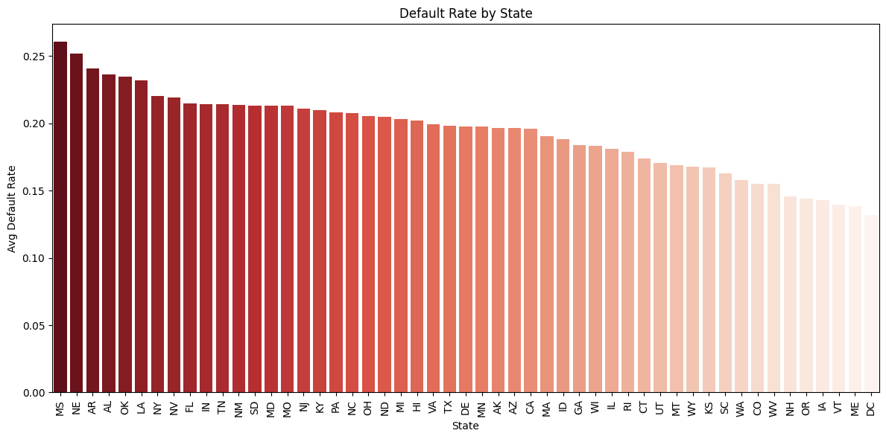

Clear geographic patterns emerge, with Mississippi (26% default rate) vs DC (13% default rate) showing stark differences.

### Loan Characteristics Impact
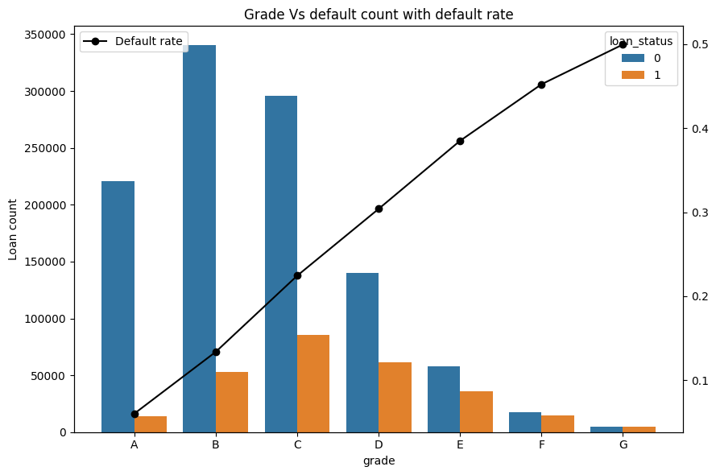
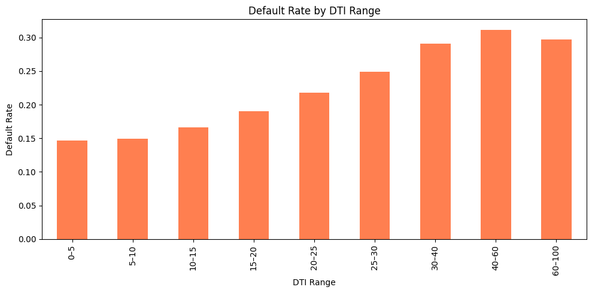
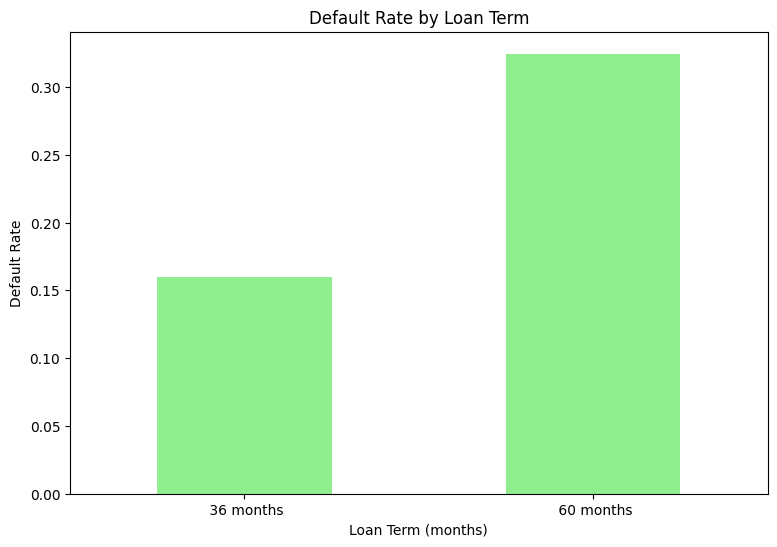

- Higher loan grades dramatically increase default risk
- Debt-to-income ratio shows clear risk escalation  
- 60-month terms double the default rate vs 36-month terms

### Model Performance & Calibration
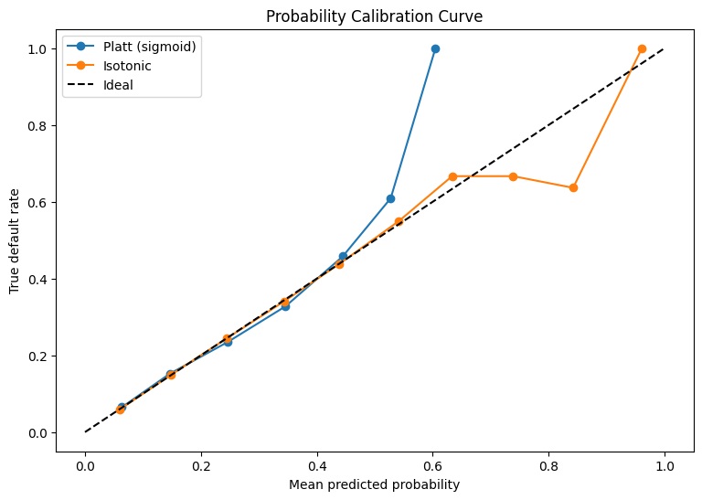
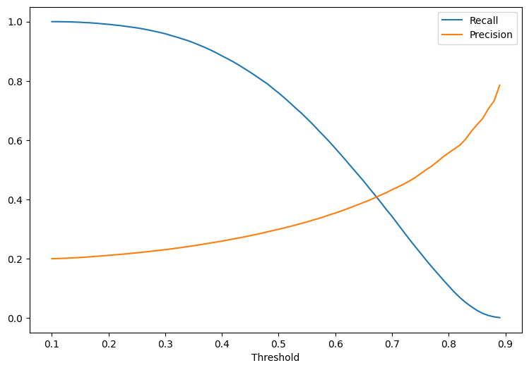

### Optuna Hyperparameters optimization history

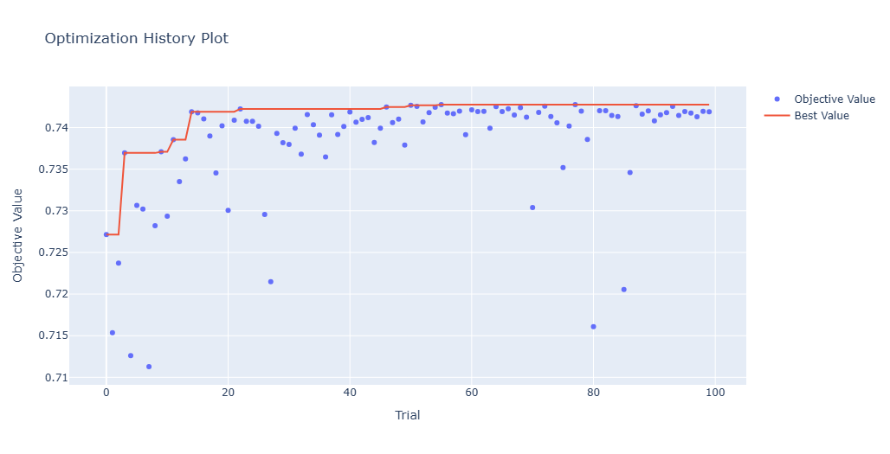

### Model Explainability(Global)

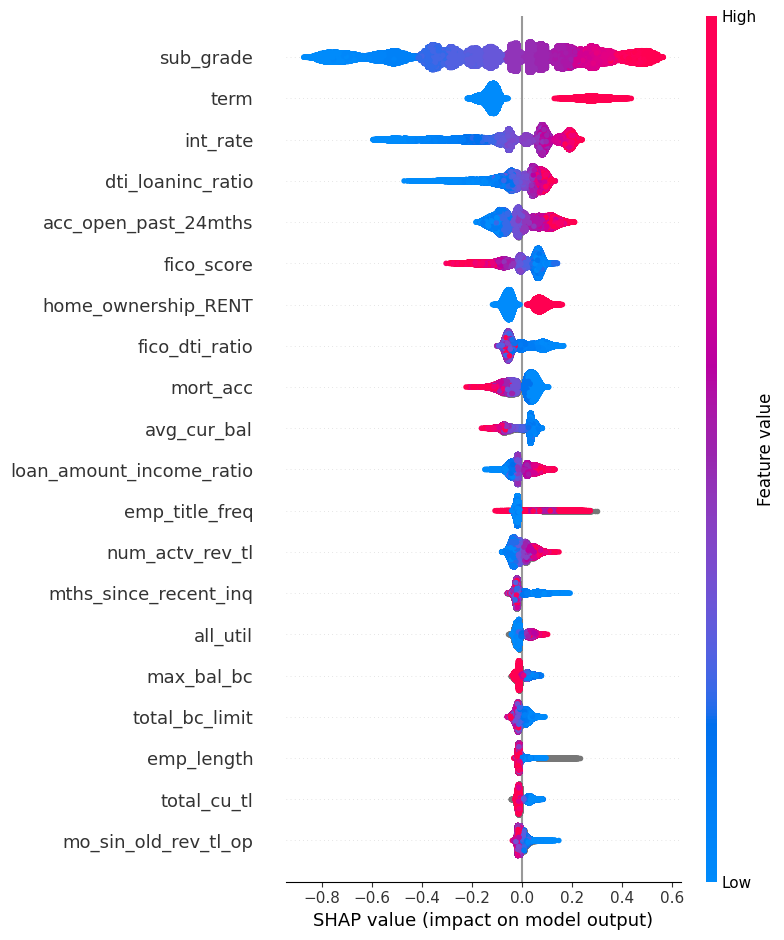

### Sample Local Explainability

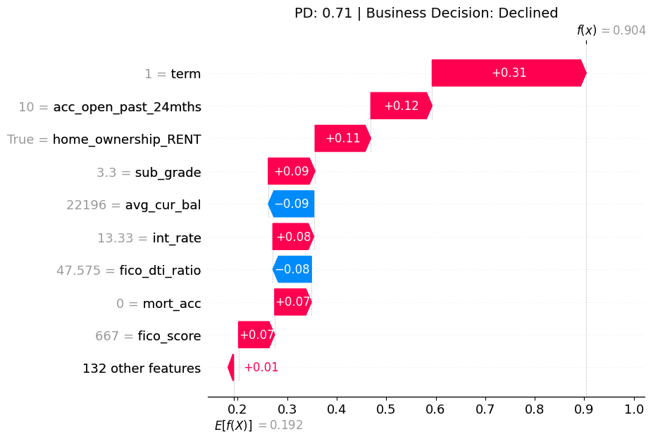

### Business Optimization
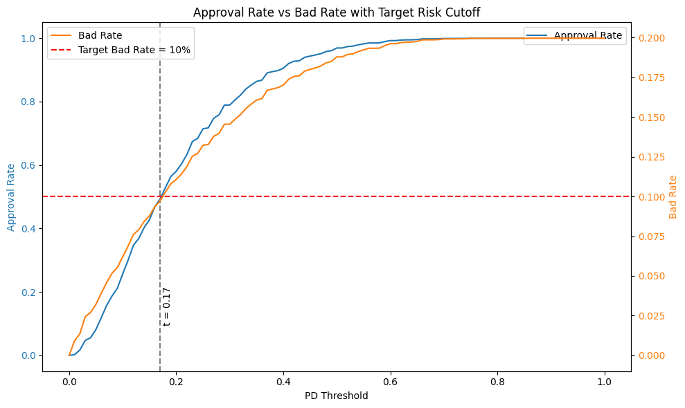

## 🚀 Project Workflow

### 1. **Data Processing & EDA** (`01_eda.ipynb`)
- Comprehensive exploration of 150+ features
- Identified key risk drivers and surprising patterns
- Feature correlation analysis and missing value treatment

### 2. **Baseline Modeling** (`02_baseline_model.ipynb`) 
- Logistic Regression and Decision Tree baselines
- Feature importance analysis
- ROC AUC ~0.70 baseline performance

### 3. **Advanced Feature Engineering** (`03_Advance_feature_engineering.ipynb`)
- Credit utilization ratios and behavioral indicators
- Delinquency flags and interaction terms
- Log transformations and binning strategies

### 4. **Advanced Modeling** (`04_Advance_modelling.ipynb`)
- XGBoost with Optuna hyperparameter optimization
- 30+ trial optimization achieving 0.73+ ROC AUC
- Ensemble methods and model stacking

### 5. **Evaluation & Deployment** (`05_Evaluation.ipynb`)
- Probability calibration for better threshold selection
- Business-focused bad rate optimization  
- SHAP explainability for regulatory compliance

## 🔧 Tech Stack

- **Data Processing**: Pandas, NumPy
- **Machine Learning**: XGBoost, Scikit-learn, Optuna
- **Explainability**: SHAP
- **Visualization**: Matplotlib, Seaborn, Plotly
- **Deployment**: Streamlit
- **Environment**: Python 3.8+

## 📈 Model Features

- **136 engineered features** including interaction terms
- **Missing value handling** optimized for tree-based models  
- **Business-relevant thresholds** for P2P lending context
- **Calibrated probabilities** for reliable risk assessment
- **Local & global explanations** for every prediction

## 🏆 Business Impact

This isn't just a data science exercise - it's designed for real-world deployment:

- **Risk-based approval** with configurable bad rate targets
- **Transparent decisions** meeting regulatory requirements  
- **Interactive dashboard** for loan officers and executives
- **Scalable pipeline** for batch and real-time scoring

## 📊 Key Features of the Dashboard

The Streamlit dashboard provides:

- **Loan Application Input Form**: Enter borrower details and loan characteristics
- **Real-time Risk Assessment**: Instant default probability calculation
- **SHAP Explanations**: Visual breakdown of decision factors
- **Business Metrics**: Approval rates and expected bad rates
- **Interactive Visualizations**: Explore model behavior across different scenarios

## 🔍 Model Performance Details

### Classification Metrics
- **Precision**: 0.23 (of predicted defaults, 23% are actual defaults)
- **Recall**: 0.76 (captures 76% of all actual defaults)
- **F1-Score**: 0.35 (balanced harmonic mean)
- **ROC AUC**: 0.73 (strong discrimination ability)

### Business Metrics
- **Bad Rate at 10% threshold**: Maintains target risk levels
- **Approval Rate**: 50% of applications approved
- **Expected Risk**: Quantified financial risk assessment

## 🚨 Important Notes

- **Model Limitations**: This model is trained on historical data (2007-2018) and may not reflect current economic conditions
- **Ethical Considerations**: Ensure fair lending practices and avoid discriminatory features
- **Regulatory Compliance**: Model explanations support regulatory requirements but legal review is recommended
- **Performance Monitoring**: Continuous monitoring required for production deployment

## 🤝 Contributing

Contributions are welcome! Please feel free to do so.

## 🙏 Acknowledgments

- **Claude AI** provided valuable assistance in developing the Streamlit dashboard and some explainability components
- **Lending Club** for making their historical data publicly available

---

*This project demonstrates end-to-end ML engineering skills, from business understanding through deployment. The focus on explainability and business metrics (rather than just accuracy) reflects real-world modeling best practices.*

**⭐ If you found this project helpful, please give it a star!**